# 🧠 Spatial-LLM

[](https://github.com/Mohammadzamanid/Spatial-LLM/actions/workflows/ci.yml)
[](https://www.python.org)
[](LICENSE)

**A neuroscience-inspired model that learns space the way the brain does — and a language model that reads the resulting cognitive map to navigate, plan, reason, and remember.**

Most "spatial" models stop at coordinate embeddings. This one builds the mammalian navigation system from its computational primitives: a self-supervised cortex with **emergent hexagonal grid cells**, **place cells**, **path integration**, **boundary error-correction**, **replay**, and a **dopamine value system** — then a LoRA-adapted LLM reads that map to answer questions in natural language. Every step below is a real neuroscience mechanism, **measured on held-out data, with honest caveats** (full record in [`results/FINDINGS.md`](results/FINDINGS.md)).

> The thesis: a human learns by *being in a place, over time* — in 4D (x, y, z, t). So we don't hand the model coordinates; we have it **move, sense, and path-integrate**, building a cognitive map the way the entorhinal–hippocampal system does, and let language ride on top.

---

## The architecture

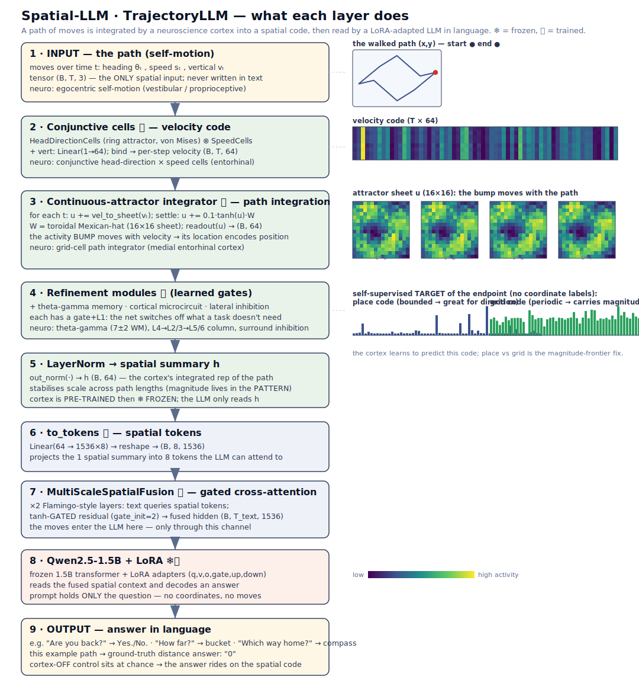

A path of self-motion → **conjunctive velocity cells** → a **velocity-driven hexagonal grid code** (multi-module continuous attractor) → a learned **place/value readout** → **gated cross-attention** into a frozen **Qwen2.5-1.5B + LoRA**, which answers in language. The moves never appear in the text — they reach the model *only* through the cortex.

---

## The arc — what one grid/place cortex can do

Each result is reproducible on CPU (`python -m src.eval.<name>`); the language results run on a single T4 (`notebooks/*.py`).

### 1 · Grid cells *emerge* (and a falsification taught us why they're hexagonal)

Trained only to predict bounded place cells, the path-integrating units develop **periodic, multi-field firing maps on their own** (Banino 2018; Hafting 2005). A square-torus attractor yields *square* grids; twisting the torus alone didn't help — but the canonical **velocity-driven** construction flips gridness from −0.46 to **+0.87** (255/256 units hexagonal). *Velocity, not connectivity, sets grid symmetry* — a prediction we falsified, then confirmed.

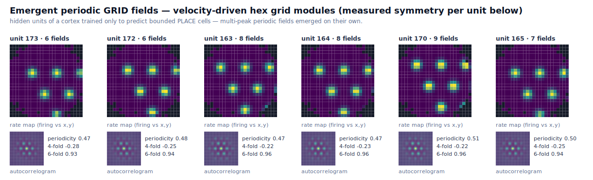

`src/eval/emergence.py` · also: path-integration distance-compression, head-direction tuning, and the **7±2** working-memory limit all emerge.

### 2 · It generalizes — across path length and across environments

A fixed-length, `/T`-normalized integrator *memorizes* its training length; a **scale-free readout trained on mixed lengths extrapolates** to paths 2–3× longer (`generalize_trajectory.py`). And the grid code is a **universal metric**: one decoder transfers across environments 0-shot while place cells **remap** (cos 0.08) and a new map forms few-shot — plus **replay** consolidates a good map from 40 trajectories (`pillars.py`).

Isolating the representation (no LLM, **mean ± 95% CI, n=8**, `extrapolation.py`): trained on short paths and tested out to 4× longer against a **fair** place baseline (cells tiled exactly to the trained region), the grid code wins at every length with non-overlapping CIs — at the 3× LLM regime, **93% vs 80%** distance accuracy — and is *more reliable* than a learned GRU integrator (±0% vs ±5%). A bounded place code *cliffs* past its trained box; the grid code degrades *gracefully* (its phase = gain·∫v is both scale-free **and** periodic — length-invariance *and* metric range). An exact-integration oracle stays flat, so the gap is the **code**, not the task.


**…but path integration alone isn't unique to grid cells — and the honest map of *when* the code helps is the point.** A Transformer with the right inductive bias (no positions + sum-pooling) extrapolates just as well (`seq_baselines.py`). The population code *does* win where a metric integrator structurally can't (`code_necessity.py`, n=5): **one-shot memory capacity** (a raw 2-D code collapses to 25% at 200 locations; a population code holds 75%) and **multi-map storage** — the same trajectory gives the same displacement in every room, so a metric code collides across environments (**4%** over 16 maps) while grid/place cells **remap** and hold **79–92%**. *But these are regime-specific:* remapping stops mattering once a model is **trained and given a context label** (a room-id embedding → 100%, like an LLM's prompt), and the grid code is *no* more sample-efficient or noise-robust than the additive baseline (`multimap_task.py`, `frontier_probes.py`). Honest verdict: the brain-faithful code is **competitive, and uniquely useful only in fixed-memory / context-free regimes** — not a universal free lunch. That map of wins, ties, and boundaries is the contribution.


### 3 · It corrects its own drift with boundaries — learned, self-supervised

Noisy path integration drifts (error ∝ √T). **Boundary cells re-anchor the grid phase** (Hardcastle 2015), cutting drift ~43%. We then removed every scaffold: the boundary localizer **learns from the agent's own dead-reckoning** (no labels), even *denoising* that teacher 5× — and still bounds the drift (−32%).

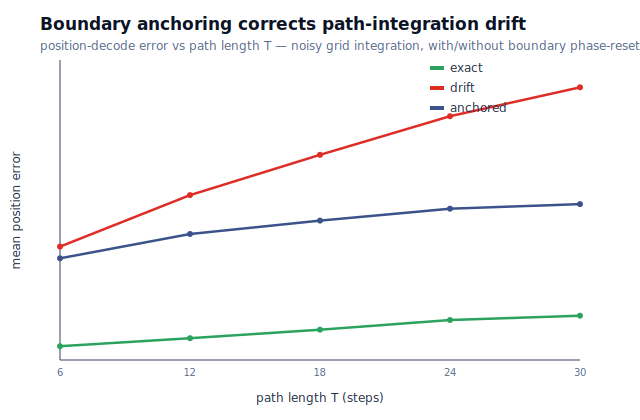

`src/eval/boundary_anchoring.py`

### 4 · Language reads the map — the cortex channel carries the answer

A LoRA-Qwen answers navigation questions *through the frozen cortex* (the prompt holds only the question; the moves reach the model only via the spatial code). The honest **multi-seed** result (n=3, 95% CI; `results/extrapolation_llm.json`): **cortex-ON sits far above the text-only OFF control** — bearing 71–81% vs ~11%, distance ~46–58% vs ~14–17% — so the LLM genuinely reasons through the self-supervised spatial code, not the text.

| cortex-ON exact, T=8/16/24 | grid | place | text-only (OFF) |
|---|---|---|---|
| "which way home?" (bearing) | **80 / 81 / 71** ±13–16 | 53 / 43 / 47 ±32–37 | ~11% |
| "how far?" (distance) | 53 / 50 / 46 ±38–42 | 58 / 40 / 30 ±11–20 | ~14–17% |

**Honest caveat:** an earlier *single-seed* run suggested a big grid-over-place win on distance (95/88/85 vs 62/46/40); it **did not replicate** across seeds (a lucky seed). At n=3 the seed variance is large and grid-vs-place is *not* statistically separable — bearing trends grid-favorable (tighter, higher, flat to 3×) but CIs overlap. The robust result is the cortex channel itself (ON ≫ OFF); the grid-over-alternatives advantage is modest, consistent with the representation-level characterization above.

`src/training/train_trajectory.py` · `notebooks/m2_extrapolation_multiseed_kaggle.py`

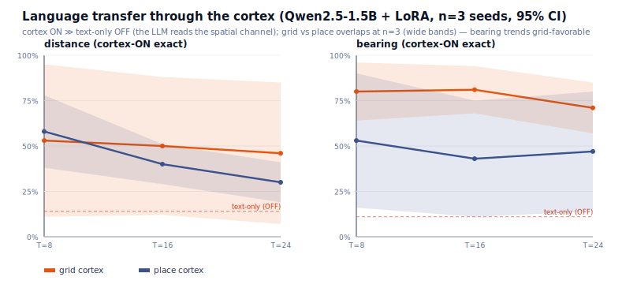


### 5 · It plans novel shortcuts (Tolman's cognitive-map test)

Because the grid code is linear, the A→B displacement is just the difference of grid codes — so the agent **plans a direct shortcut to a goal it reached only by a winding detour** (vector navigation, Bush 2015; forward-replay/preplay, Pfeiffer & Foster 2013): **0.33° direction error, 100% navigable, 29% shorter** than retracing known routes.

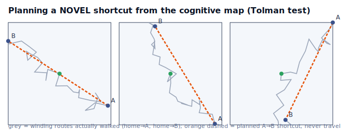

`src/eval/planning.py`

### 6 · It seeks reward — a dopamine-learned value map

From **sparse, unlabeled reward**, a value head trained by a dopamine-like prediction-error (Schultz 1997) **localizes the goal** (0.33 from truth) and drives **goal-directed navigation: 95% success in 6 steps** vs a random walker's 29% in 14. The prediction error shrinks as the world becomes predicted.

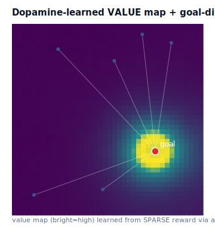

`src/eval/goal_navigation.py`

### 7 · It does *relational* inference — the same map, beyond physical space (TEM)

Lay an abstract ordered structure along a concept axis, map it with the *same* grid cortex, teach only **adjacent** comparisons → it performs **transitive inference (84%)** on never-seen pairs, shows the **symbolic-distance effect** (far-apart = easier, 69%→100%), and **transfers the structure (78%)** to a new item set (Tolman–Eichenbaum Machine, Whittington 2020; Constantinescu 2016).

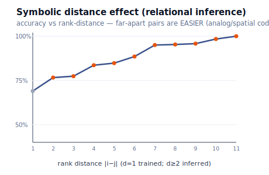

`src/eval/relational.py`

### 8 · It learns one-shot and continually — no catastrophic forgetting

A **single visit** forms a localized place field (behavioral-timescale plasticity, Bittner & Magee 2017). Learning 20 places one-by-one, the one-shot, pattern-separated store **recalls all of them (~96%, flat across age)** while a shared gradient-trained net **catastrophically forgets** the oldest (→0%). Complementary Learning Systems (McClelland–O'Reilly 1995), made concrete.

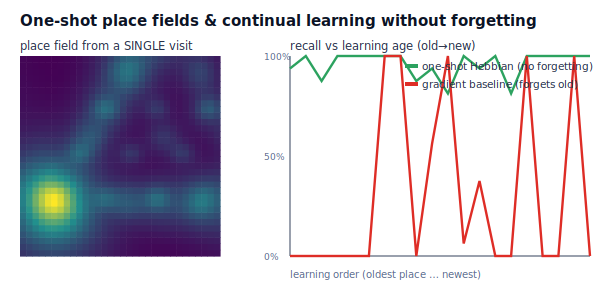

`src/eval/continual.py`

### 9 · It is grounded in perception — path integration from vision

No hand-given heading/speed: the agent gets a **retinal panorama** of a landmark world and a learned front-end **estimates self-motion from optic flow** (direction cosine **0.97**). The grid map path-integrates *that* and localizes from **vision alone** (error 0.48→1.33 over T=6→24) — the residual being optic-flow drift, exactly what the boundary pillar corrects. The two pillars meet.

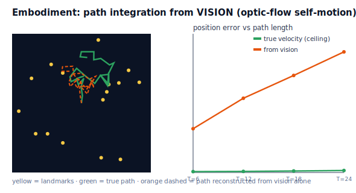

`src/eval/embodiment.py`

### 10 · Its map is *predictive*, not just geometric — it plans around barriers

A metric map only points; a **predictive** map plans. The **successor representation** M=(I−γT)⁻¹ (expected discounted future occupancy; Dayan 1993, Stachenfeld 2017) reaches a goal **100%** of the time when a wall blocks the straight line — where greedily descending Euclidean distance stalls at **62%** because the gradient points *into* the wall (paired p=0.009; on an open field both succeed, so the gain is the detour). Its place fields bend around the barrier, tracking **geodesic** not Euclidean distance (0.69 vs 0.31), and the map is **learned from experience** by a TD rule (0.97 vs the closed form).

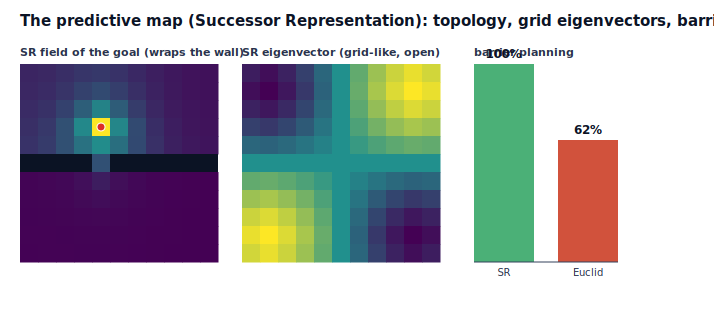

`src/eval/successor.py`

### 11 · It keeps *time* — hippocampal time cells with scalar (Weber) timing

Beyond space, the cortex tiles **elapsed time** with **time cells** whose fields **widen with their latency** (Eichenbaum 2014; MacDonald 2011; Howard's scale-invariant timing). That widening *causes* the brain's signature **scalar (Weber) timing**: temporal precision — the just-noticeable difference JND = 1/‖da/dt‖ — degrades ~linearly with elapsed time (**corr 0.95**) where a fixed-width control stays flat (**0.01**), measured from the code geometry, not a decoder. The standard parameter-free **population vector** still reads elapsed time (**R²=0.996**) and event order (**100%**).

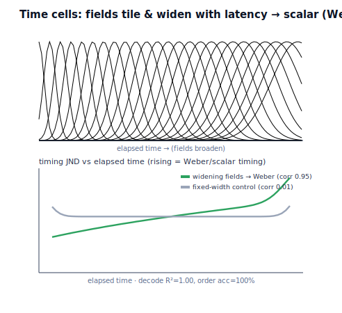

`src/eval/time_cells.py`

---

## How it learns like a brain

`world → retinal panorama → optic-flow self-motion → velocity-driven hexagonal grid cells → place cells (Hebbian, one-shot) → boundary error-correction → value (dopamine) → planning / relational inference → predictive (successor) & temporal (time-cell) maps → language readout`

One self-supervised spatial cortex, spanning **navigation → language → planning → motivation → abstract reasoning → lifelong memory → perception → prediction & time** — each piece a documented neuroscience mechanism, each result measured on held-out data, each caveat stated.

---

## Honest scope — what a real brain still has beyond this

Stated plainly (full caveats per-section in [`results/FINDINGS.md`](results/FINDINGS.md)):

- **Biophysical realism** — rate units + phase accumulation, not spiking neurons / continuous-time recurrent attractor dynamics (the repo *has* `spiking_neurons.py`, `synaptic_plasticity.py`, but the cognitive-map results use rate models).
- **Real perception** — a panoramic landmark abstraction, not pixels through a visual cortex; translation-only; 2D arenas.
- **One unified, locally-learned whole** — the pieces are individually faithful but mostly trained separately by backprop; the brain is one continuously-, locally-learning system.
- **Scale & open-endedness** — orders of magnitude smaller than a real cortex, in closed toy worlds.

These are research programs, not quick fixes. The contribution here is **breadth of faithful mechanism + honest measurement**, not a complete brain.

---

## The neuroscience stack (single neuron → network)

The repo implements brain-grounded modules at every level of organization; the cognitive-map arc above is built mainly from the **spatial-cell, oscillation, and microcircuit** rows.

| Level | Module | Biological basis | Reference |
|---|---|---|---|
| **Single neuron** | `LIFNeuron`, `AdaptiveLIFNeuron`, `DendriticNeuron` | LIF dynamics, spike-frequency adaptation, multi-compartment dendrites | Gerstner 2002; Gidon 2020 |
| **Synapse** | `HebbianLayer`, `STDPLayer`, `ShortTermPlasticity` | Oja-normalized Hebbian, STDP, facilitation/depression | Oja 1982; Bi & Poo 1998 |
| **Microcircuit** | `DivisiveNormalization`, `LateralInhibition`, `EIBalanceLayer`, `CorticalColumn` | gain control, surround suppression, Dale's law, L4→L2/3→L5/6 | Carandini & Heeger 2012 |
| **Spatial cells** | `_HexGridModules`, `HeadDirectionCells`, `BoundaryVectorCells`, `ConjunctiveSpatialCells`, `SpeedCells` | velocity-driven hexagonal grid modules, ring-attractor HD, boundary vectors | Burak & Fiete 2009; Taube 1990; Lever 2009; Kropff 2015 |
| **Oscillations** | `ThetaOscillator`, `PhasePrecession`, `ThetaGammaCoupling`, `SharpWaveRipple` | theta gating, phase precession, 7±2 buffer, replay | O'Keefe & Recce 1993; Lisman & Idiart 1995; Buzsáki 2015 |
| **Systems** | `TrajectoryCortex`, `TrajectoryLLM`, value/relational/continual readouts, successor & time-cell maps | path integration, grid→place, dopamine RPE, CLS, TEM, successor representation, scalar (Weber) timing | Banino 2018; Schultz 1997; McClelland 1995; Whittington 2020; Stachenfeld 2017; Eichenbaum 2014 |

---

## Reproduce it

```bash
git clone https://github.com/Mohammadzamanid/Spatial-LLM.git
cd Spatial-LLM
pip install -e ".[dev]"

# --- the cognitive-map arc (CPU, minutes each; writes results/*.json + *.svg) ---
python -m src.eval.emergence            # emergent grid cells, PI drift, HD tuning, 7±2
python -m src.eval.emergence --topology hex            # twisted torus (falsification)
python -m src.eval.emergence --constrained             # velocity-driven hexagonal grids (+0.87)
python -m src.eval.generalize_trajectory # length generalization (scale-free vs /T)
python -m src.eval.boundary_anchoring    # boundary drift-correction (geometric/learned/bootstrap)
python -m src.eval.pillars               # remapping, replay, Hebbian place cells
python -m src.eval.planning              # Tolman shortcut (vector navigation + preplay)
python -m src.eval.goal_navigation       # dopamine value map + goal-directed navigation
python -m src.eval.relational            # transitive inference + symbolic distance effect
python -m src.eval.continual             # one-shot place fields, no catastrophic forgetting
python -m src.eval.embodiment            # path integration from vision (optic flow)

# --- the language model reading the map (single T4) ---
# copy notebooks/m2_grid_cortex_all_tasks_kaggle.py cells into Kaggle:
python -m src.training.train_trajectory --task distance --constrained_velocity --early_stop
```

---

## Project structure

```
Spatial-LLM/
├── src/models/neuro/
│   ├── trajectory_cortex.py     ← the cognitive map: conjunctive cells, _HexGridModules
│   │                              (velocity-driven hex grids, boundary anchoring), _AttractorIntegrator
│   ├── spatial_cells.py          ← head-direction, boundary, speed, conjunctive cells
│   ├── oscillations.py           ← theta, phase precession, theta-gamma (7±2), replay
│   └── microcircuits.py          ← divisive norm, lateral inhibition, E/I, cortical column
├── src/models/trajectory_llm.py  ← TrajectoryLLM: cortex → spatial tokens → Qwen+LoRA
├── src/models/fusion.py          ← gated cross-attention (Flamingo-style)
├── src/training/train_trajectory.py ← M2 trainer (tasks, mixed lengths, early stopping)
├── src/data/trajectory_qa.py     ← return / bearing / distance navigation QA
├── src/eval/                     ← emergence, generalize, boundary, pillars, planning,
│                                    goal_navigation, relational, continual, embodiment,
│                                    successor (predictive map), time_cells (Weber timing), …
├── results/                      ← FINDINGS.md (full record) + per-experiment *.json + *.svg
├── notebooks/                    ← Kaggle cells for the LLM runs
└── tests/
```

The original geographic-QA stack (grid-cell coordinate encoder, ViT tiles, hippocampal memory, Qwen fusion for lat/lon questions) also lives here — see [`results/FINDINGS.md`](results/FINDINGS.md) for the elevation-probe and 2D-vs-3D coordinate results that started this project.

---

## Citation

```bibtex
@software{spatial_llm_2025,
  author  = {Mohammadzamanid},
  title   = {Spatial-LLM: a neuroscience-inspired spatial cognitive map read by a language model},
  year    = {2025},
  url     = {https://github.com/Mohammadzamanid/Spatial-LLM}
}
```

*Full, honest experimental record — every number, every caveat, every falsification — in [`results/FINDINGS.md`](results/FINDINGS.md).*
