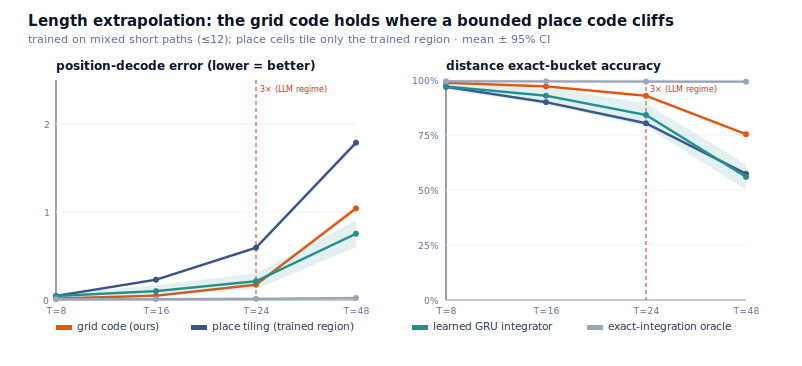
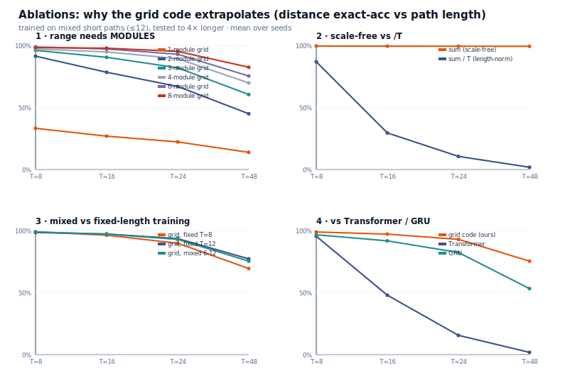
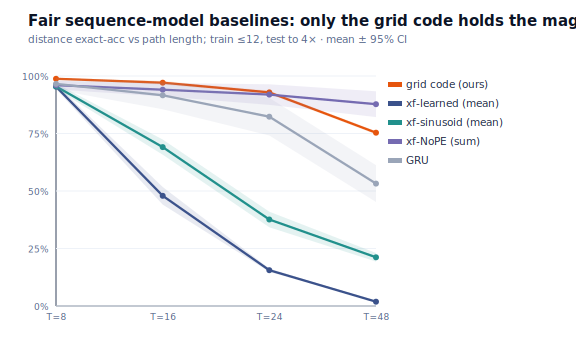
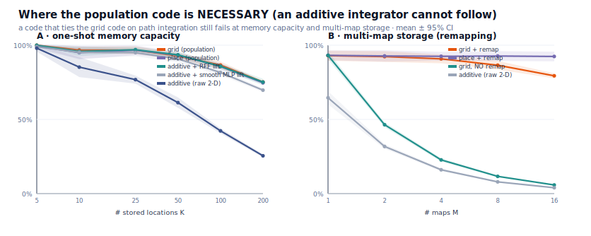

# Spatial-LLM — Findings so far

A neuroscience-inspired spatial encoder (Fourier coordinates, grid cells, place-cell
memory, ViT tiles) fused via gated cross-attention into a LoRA-adapted Qwen2.5-1.5B.
Probe task: elevation-threshold classification — *"is this location above the median
elevation (122 m)?"* — on real GeoNames cities, evaluated on held-out cities.

## Headline results — balanced accuracy (3 seeds, ~693–699 val examples)

| setup | location reaches model via | elevation given? | balanced acc |
|---|---|---|---|
| `coord_3d_noleak` | spatial channel only | yes (3rd coord) | **0.983 ± 0.005** |
| `coord_2d_noleak` | spatial channel only | no — must infer | **0.704 ± 0.019** |
| Step 1 `coord_3d` (leaky) | text + channel | yes | 0.974 (1 seed) |
| Step 1 `coord_2d` (leaky) | text + channel | no | 0.717 (1 seed) |
| chance | — | — | 0.50 |

## What we learned

1. **The spatial pathway works.** With coordinates removed from the prompt text — so
   location reaches the model *only* through the coord embedder + grid cells — the
   model still solves the task (0.98 when elevation is supplied, 0.70 when it must be
   inferred). The encoder genuinely conveys spatial information to the LLM.

2. **The encoder learned real geography.** Given only lat/lon and *no* elevation
   input (`coord_2d_noleak`), it predicts elevation-above-median at **0.70**, far above
   chance — i.e. it interpolates elevation over location for cities it never saw.

3. **Step 1's 2D-vs-3D gap is real, not a leak artifact.** `coord_2d_noleak` (0.704)
   reproduces the leaky Step-1 `coord_2d` (0.717) almost exactly, and `coord_3d_noleak`
   (0.983) ≈ leaky `coord_3d` (0.974). The gap measures the value of being handed
   elevation directly (3D) versus inferring it from location (2D).

4. **A methodology bug, found and fixed.** The prompt template originally injected
   lat/lon as text, letting the LLM read coordinates and recall elevation from
   pretraining — bypassing the spatial stack entirely (its gates sat at ~0 while
   accuracy was ~0.99). The `coords_in_text=false` mode is required to actually test
   the encoder.

5. **Per-module fusion gating ("synchronization") does not help.** No accuracy gain
   over a single shared gate, and less stable (one seed collapsed to 0.68). Dropped.

6. **Gate magnitude is not a usage read-out.** Fusion gates stayed ~0.002 in every
   run, yet in the no-leak runs that tiny gate carries the entire signal. Judge by
   accuracy, not gate value.

## Navigation cortex: static vs movement — the "harmful → essential" inversion

The neuroscience modules (grid attractor, conjunctive, boundary, theta-gamma,
microcircuits) were ablated on TWO tasks. The verdicts **flip with the task** —
confirming these are a *navigation* system that needs movement and time to be useful.

**Static task** — classify one fixed (lat,lon) into a 100-way grid (`ablation.py`):

| module removed | Δ accuracy | verdict |
|---|---|---|
| grid_attractor | −91.6% | load-bearing |
| boundary | −9.3% | helps |
| cortical_column | +3.7% | mildly harmful |
| lateral_inhibition | +7.1% | harmful |
| conjunctive | +7.1% | **harmful** (no movement → dormant) |
| phase | +7.2% | **harmful** (no movement → dormant) |

**4D navigation task** — integrate a sequence of moves (heading, speed, vertical
velocity) over time *t* → final (x,y,z) (`ablation_trajectory.py`; 3 seeds, T=12,
metric = within-0.15 accuracy, full stack = 95.3%):

| module removed | accuracy | Δ vs full | verdict |
|---|---|---|---|
| conjunctive | 0.0% | **−95.3%** | **essential** (was +7.1% harmful!) |
| lateral_inhibition | 86.5% | −8.8% | helps (was +7.1% harmful!) |
| grid_attractor | 88.4% | −6.9% | helps |
| theta_gamma | 95.6% | +0.3% | neutral |
| cortical_column | 98.7% | +3.4% | mildly harmful |

**The inversion:** `conjunctive` (head-direction × speed = velocity binding) goes from
+7.1% *harmful* on the static task to **−95.3% essential** on the movement task —
without it the model can't read the moves and fails completely. `lateral_inhibition`
flips the same way; `grid_attractor` (the path integrator) is load-bearing on both.

**Synchronization helps.** Giving each module its own auxiliary target-prediction
signal (aux loss) lifts the full stack 95.3% → 97.9% (err 0.092 → 0.075). This is the
concrete, working form of "synchronize the modules" — each specialises against its own
objective instead of training as one tangled blob.

**Managing complexity — the empirical rule:** match the module set to the task.
Movement modules are dead weight (even harmful) on static tasks and essential on
movement tasks. `theta_gamma` and `cortical_column` aren't needed for *simple* path
integration — making them load-bearing needs order-dependent tasks (see recall, below).

### Order-dependent recall — the integrator earns its keep

Final-position path integration is a commutative sum, so the elaborate modules are
redundant. The **recall** task — *"where were you at step k?"* — is order/history-
dependent: a sum can't answer it; the model must keep a RUNNING per-step position
(`ablation_trajectory.py --task recall`; 3 seeds, T=12, full stack acc = 99.8%).

| module removed | accuracy | Δ vs full | verdict |
|---|---|---|---|
| conjunctive | 0.4% | −99.3% | essential |
| grid_attractor | 3.9% | **−95.8%** | **essential** — flips from *redundant* on path-integration |
| theta_gamma | 99.8% | +0.1% | neutral |
| cortical_column | 99.6% | −0.2% | neutral |
| lateral_inhibition | 99.6% | −0.2% | neutral |

The **grid attractor** (recurrent path integrator) is redundant when only the final
point matters but **load-bearing** when the task needs the trajectory's history — same
module, opposite verdict, decided entirely by the task. (`add_one_in`: no single module
suffices — recall needs the velocity encoder AND the integrator together.)

### Task-dependent complexity — the model prunes itself (learned gates)

Each optional module (theta-gamma, microcircuits) gets a learned gate + L1 cost, so the
network can switch off what it doesn't need (`--mode gates`, L1=0.05):

| task | full (ungated) | gated acc | learned add-on gates |
|---|---|---|---|
| pathint | 95.3% | **97.3%** | all → ~0.1–0.36 (OFF) |
| recall | 99.8% | 94.1% ±6.9% | all → ~0.1–0.16 (OFF) |

On both tasks the model drives the add-on gates toward 0 — it discovers they aren't
load-bearing and switches them off (on pathint this *improves* accuracy; on recall the
aggressive L1 is slightly costly/noisier — gate strength is a knob). The structural
velocity-encoder + integrator always stay on because the task is unsolvable without them.

**The complexity rule, made mechanical:** ablation reveals which modules a task needs;
the gates let the model *enforce* it — keep the load-bearing ones, switch off the rest,
per task. The "harmful module" problem dissolves: a module that doesn't help is gated off.

### Memory-bottleneck recall — theta-gamma earns its keep

The recall task above used attention over the FULL step sequence, so there was no memory
pressure and theta-gamma stayed neutral. **memrecall** forces the trajectory through a
fixed-size bottleneck: the whole path is multiplexed into ONE vector and the answer is
read back from that vector alone (`--task memrecall`; 3 seeds, T=7, full acc = 99.9%).

| module removed | accuracy | Δ vs full | verdict |
|---|---|---|---|
| conjunctive | 0.7% | −99.3% | essential |
| theta_gamma | 7.0% | **−92.9%** | **essential** — ordered memory; mean-pool can't recall by index |
| grid_attractor | 99.6% | −0.3% | neutral (the memory compensates at short T) |
| cortical_column / lateral_inhibition | ~99.8% | ~0 | neutral |

Theta-gamma's phase-slot multiplexing (Lisman-Idiart) preserves order + identity through
the bottleneck; replacing it with a mean-pool collapses both and recall-by-index fails.

**The 7±2 limit emerges.** `ThetaGammaMemory` has ~8 slots. Recall stays near-perfect
while the trajectory fits, then collapses as it overflows — a capacity limit that falls
out of the architecture, not a tuned hyperparameter:

| trajectory length T | 4 | 7 | 10 | 14 |
|---|---|---|---|---|
| recall accuracy | 99.6% | 99.9% | 70.1% | 30.7% |

### Each module is load-bearing on the task it was built for

| task | what it requires | essential module(s) |
|---|---|---|
| static localization | a position code | grid cells |
| path integration | velocity binding | conjunctive |
| order-dependent recall | running per-step position | conjunctive + grid attractor |
| memory-bottleneck recall | ordered working memory | conjunctive + theta-gamma |

The whole stack earns its keep — not all at once, but each module exactly when the task
demands it; the learned gates switch off the rest.

## Milestone 2 — the LLM answers trajectory questions in language

The path (a sequence of moves) is encoded by the recurrent cortex into spatial tokens
and fused into a LoRA-adapted Qwen2.5-1.5B; the prompt holds ONLY the question
("Are you back where you started?"), so the moves reach the model *solely* through the
cortex. Training the whole stack end-to-end from the single yes/no token collapses to
the class prior, so the cortex is pre-trained on path integration first, then frozen,
and the LLM learns to read it (`src/training/train_trajectory.py`).

| cortex pre-training | cortex ON | cortex OFF (control) | contributes |
|---|---|---|---|
| supervised (regress final x,y,z) | 99.8% | 51.3% (chance) | +48.5% |
| **self-supervised (place-cell prediction, no coords)** | **99.7%** | 51.3% (chance) | **+48.3%** |

cortex-OFF at chance confirms the LLM answers *through* the spatial cortex, not the text.
**The self-supervised version matches the supervised one (99.7% vs 99.8%) with zero
coordinate labels** — the cortex learned navigation from its own movement + sensory
landmarks, and language then read it. That is the biologically faithful result.

**Caveat (honest).** The cortex is trained before the LLM, not end-to-end. This is
defensible developmentally — the brain's grid/place/head-direction system is largely
innate and present in pups before much experience (Langston 2010; Wills 2010), and the
sensorimotor stage precedes language. The genuinely unrealistic part of the *supervised*
run is the position LABELS. The **self-supervised** protocol removes them: the cortex
predicts the place-cell code of where it ends up (a sensory function of position) and
must recover position internally — the way grid codes emerge (Banino 2018; Cueva & Wei
2018). A probe confirms "back-at-start" is ~100% readable from that no-label rep, so the
LLM can use it just as well. (`--cortex_pretrain selfsup`, now the default.)

## Generalization stress-test — does the integrator learn the OPERATION, or memorize the length?

Every result above trains and tests at the SAME trajectory length. The decisive
question for "did it really learn path integration": train on SHORT walks, then test
on LONGER, unseen lengths. A model that learned the operation ("sum the per-step
displacements") extrapolates; one that calibrated to the training length does not.

We isolate the suspect — the `/T` length-normalisation in `_AttractorIntegrator`
(`readout(u / T)`) — and cross it with the training distribution
(`src/eval/generalize_trajectory.py`; train T=8, eval T∈{4,8,12,16,24,32}, 3 seeds).
Read-out is **`mag_ratio = mean‖pred‖ / mean‖true‖`** (1.0 = correctly scaled at that
length; <1 under-shoots, >1 over-shoots) and **`rel_err`** (flat across T ⇒ length-invariant).

| mode (architecture, training) | T=4 | **T=8 train** | T=12 | T=16 | T=24 | T=32 |
|---|---|---|---|---|---|---|
| `shipped` — M2 cortex (`/T` + LayerNorm), fixed T | 2.60 | **1.00** | 0.65 | 0.48 | 0.32 | 0.24 |
| `norm` — integrator `/T`, fixed T | 1.99 | **0.99** | 0.67 | 0.50 | 0.34 | 0.26 |
| `free` — integrator scale-free, fixed T | 1.21 | **0.98** | 1.17 | 1.47 | 2.27 | 3.04 |
| `norm_mixed` — `/T`, MIXED lengths (≤16) | 1.46 | **1.00** | 0.85 | 0.76 | 0.64 | 0.55 |
| **`free_mixed` — scale-free, MIXED lengths (≤16)** | **0.89** | **0.90** | **0.90** | **0.89** | **0.88** | **0.93** |

*(values are `mag_ratio`, mean over 3 seeds; std ≤0.07 for the `/T` modes.)*

1. **Fixed-length training = length memorization — for EVERY architecture.** `shipped`,
   `norm`, `free` all nail the train length (mag_ratio≈1.00) and all break away from it,
   in opposite directions: the `/T` modes **under-shoot with mag_ratio ≈ train_T / test_T**
   (0.5 at 2×, 0.25 at 4×, 2.0 at ½× — a textbook length-calibration artifact), while the
   scale-free model **over-shoots** (3× at T=32) because its accumulator's magnitude tracks
   step *count*, not net displacement. `rel_err` grows monotonically with |T−8| in all three.

2. **Mixed-length training makes the operation generalize — and now the readout matters.**
   `free_mixed` (scale-free + lengths sampled from {4…16}) is **flat: mag_ratio 0.86–0.93 and
   rel_err ~0.65 across the whole sweep, including the held-out T=24 and T=32 — 2× beyond its
   longest training length.** That is genuine extrapolation: error does NOT grow with
   extrapolation distance. `norm_mixed` helps but still droops to 0.55 at T=32 — the `/T`
   that *enabled* one-length memorization now mildly *fights* length-invariance.

3. **Verdict.** The Milestone-2 cortex's failure to extrapolate is primarily a
   **training-distribution artifact (it only ever saw one length), compounded by the `/T`
   readout** — not a fundamental limit. The path-integration operation is genuinely
   learnable and length-invariant, given (a) length-diverse training and (b) a scale-free
   readout. *Recommendation:* if TrajectoryLLM should answer about paths of any length,
   pre-train the cortex on mixed T with `readout(u)` (no `/T`), not the current fixed-T + `/T`.

4. **The cost of generalizing.** The length-invariant `free_mixed` is *less precise at any
   single length* than a specialist (rel_err ~0.65 vs 0.08 for the fixed model at its train
   T) — a clean generalization-vs-specialization tradeoff. Its mag_ratio ~0.9 (slight
   under-scale) is honest, not pinpoint; the flatness across length, not the absolute value,
   is the extrapolation evidence, and more training steps would likely tighten it.

See `results/generalize_trajectory.json` for per-seed numbers.

### Folded back into the real model — TrajectoryLLM answers about LONGER paths

We applied the recommendation to Milestone 2 and re-ran the full TrajectoryLLM
(Qwen2.5-1.5B + LoRA, frozen self-supervised cortex) on Kaggle (T4). Both models train on
SHORT paths and answer *"Are you back where you started?"* at T=8, 16, 24 — the longer two
are held out (`train_trajectory.py --train_lengths … --eval_lengths 8 16 24 [--cortex_scale_free]`).

| recipe | T=8 (train) | T=16 (held-out) | T=24 (held-out, 2× train) |
|---|---|---|---|
| baseline — fixed T=8 + `readout(u/T)` | **99.0%** | 83.0% | 69.0% |
| **fix — mixed {6,8,10,12} + scale-free `readout(u)`** | 96.0% | **89.0%** | **86.0%** |
| cortex OFF (text-only control) | ~47% | ~56% | ~48% |

- **The fix generalizes; the baseline degrades.** One length + `/T` loses 30 points by T=24
  (99→69); mixed-length + scale-free loses only 10 (96→86) and beats the baseline by
  **+17 points at T=24** — answering correctly about paths 2× longer than any it trained on.
  The cortex-level "back-at-start" probe shows the same trend, cleaner: **1.00 / 0.96 / 0.93**
  (fix) vs **0.99 / 0.90 / 0.86** (baseline) — the scale-free cortex's rep is the more
  length-invariant one, exactly as the isolated stress-test predicted.
- **cortex OFF stays at chance at every length** → the LLM answers THROUGH the cortex, not
  the text, even when extrapolating.
- **Honest nuance.** The baseline doesn't *collapse* (69% > chance): the binary return
  question is more forgiving than raw magnitude regression — the self-supervised place-code
  (+ LayerNorm) carries a partly length-robust pattern. And the fix isn't perfect (86%, and
  it concedes ~3 points at the training length — the generalization-vs-specialization
  tradeoff again). But the operation transfers: the M2 model now reasons about path lengths
  it never saw, and the recommendation measurably helps on the real LLM, not just the
  isolated integrator. (`results/m2_lengthgen_baseline.json`, `…_scalefree_mixed.json`;
  cells in `notebooks/m2_length_generalization_kaggle.py`.)

### Harder questions — magnitude vs direction (the integrator's frontier)

The binary "are you back where you started?" is forgiving. We raised the bar with two
*multi-class* questions answered in language through the SAME frozen self-supervised cortex
(generalizing recipe; train on 6–12, test 8/16/24; `--task distance|bearing`):

  - **distance** — "How far are you from where you started?" → quantized bucket 0–5 (MAGNITUDE)
  - **bearing**  — "Which direction is the start from here?" → 8-way compass word (DIRECTION)

| task | metric | T=8 (train) | T=16 (held-out) | T=24 (held-out) |
|---|---|---|---|---|
| **bearing** (8-way) | exact ON / OFF | **71% / 17%** | **78% / 18%** | **73% / 12%** |
| | within-1 ON / OFF | 91% / 42% | 92% / 36% | 90% / 35% |
| | chance | 17% | 18% | 15% |
| **distance** (6 buckets) | exact ON / OFF | **62% / 26%** | 46% / 17% | 40% / 14% |
| | within-1 ON / OFF | 94% / 87% | 78% / 74% | 81% / 71% |
| | chance | 38% | 29% | 33% |

**Direction generalizes; magnitude is the frontier — and that split is mechanistically exactly right.**
- **Bearing is the clean win.** 71–78% exact (≥90% within one compass point) on an 8-way
  question — and it does NOT degrade with length (T=16 even edges T=8). The cortex probe
  agrees: 94/96/91%, flat. Because direction-home is SCALE-INVARIANT, a length-invariant
  cortex reads it off at any path length. cortex-OFF sits at chance (12–18%), so the LLM
  answers ~4× above chance purely through the spatial channel — even 3× beyond training length.
- **Distance is solid in-distribution but decays out of it.** 62% exact / 94% within-1 at
  the trained scale, falling to 40% exact at T=24 (probe 85→37%). Magnitude is the one
  quantity whose SCALE must extrapolate, and the place-code position rep (magnitude-normalised
  by the cortex LayerNorm) loses precision at distances it saw less of. Still, exact ON beats
  the text-only control at every length (+26/+29/+26) and beats chance in-range — the cortex
  genuinely supplies "how far", just imperfectly when the scale itself is novel. (within-1 is
  weakly discriminating here — the distribution is concentrated, so OFF also scores high;
  exact is the real signal for distance, whereas for bearing within-1 IS discriminating.)

**The takeaway:** these harder questions separate what the spatial code carries *robustly*
(DIRECTION, scale-free → generalizes flat) from what it carries only *near the trained scale*
(MAGNITUDE → degrades with length). The binary task hid this; asking for the displacement
vector exposes it. Both still ride entirely on the cortex (OFF ≈ chance).
(`results/m2_distance.json`, `results/m2_bearing.json`; `notebooks/m2_harder_tasks_kaggle.py`.)

### Attacking the magnitude frontier — fixed with GRID cells (the brain's own answer)

distance was the one question that degraded with length. We isolated the candidate levers on
the cortex's distance probe (CPU, no LLM; train on 6–12, read distance at 8/16/24; 3 seeds;
`src/eval/magnitude_frontier.py`):

| self-supervised cortex target | out LayerNorm | T=8 | T=16 | T=24 |
|---|---|---|---|---|
| **place cells** (bounded Gaussian — M2 default) | on | 91% | 69% | 44% |
| place cells | off | 61% | 28% | 17% |
| multi-scale place cells | on | 89% | 67% | 37% |
| **GRID cells (periodic, multi-scale) — the faithful fix** | on | **93%** | **82%** | **60%** |
| *position-regression (supervised, uses labels — reference)* | on | *95%* | *89%* | *67%* |
| position-regression | off | 84% | 41% | 22% |

1. **The bottleneck is the CODE, and the brain's fix is grid cells.** Place cells are *bounded
   and localized* — no field, no code outside the trained arena (and a bigger arena just goes
   sparse and collapses: env8/K1500 → 31/27/24%). That bounded code is *why* magnitude didn't
   extrapolate — a biologically real limit. **Grid cells** use a *periodic, multi-scale (modular)*
   code that represents a metric over a large range and extrapolates beyond the trained arena
   (Banino 2018; Fiete modular coding). Swapping the self-supervised target from place→grid lifts
   T=16 69→82% and T=24 44→60% — recovering most of the gap to the supervised upper bound,
   **with zero coordinate labels and a *more* brain-faithful code, not less.**
2. **Bypassing the LayerNorm HURTS, everywhere** (e.g. supervised T=24 67→22%). Magnitude lives
   in the rep's PATTERN, not its scalar norm; the LayerNorm stabilises the scale-free integrator's
   growing activity across lengths, and removing it exposes that instability. (Our initial
   "LayerNorm normalises magnitude away" guess was wrong — the sweep refuted it.)
3. **Naïve multi-scale *place* cells didn't help** (≈ single-scale) — coarse Gaussian fields
   alongside fine ones aren't the same as a periodic grid code; periodicity is what carries range.
4. **A residual length-degradation persists even with the best target** (grid 93→60%, supervised
   95→67%): recurrent path-integration error ACCUMULATES over more steps, independent of readout
   — the genuinely hard, possibly irreducible part.

**Verdict: the magnitude frontier is largely FIXABLE, and the fix is biologically faithful.**
Direction (bearing) generalised for free because it is scale-invariant; magnitude needed the
right spatial *code* — and switching place→**grid cells** (still self-supervised, no labels)
recovers most of it, leaving only a residual long-horizon integration drift. The neuroscience
made the prediction (grid cells are the entorhinal metric/path integrator) and it held.

**Confirmed on the full LLM.** Re-running distance with the grid-cell cortex (`--task distance
--code grid`, still self-supervised, NO labels) reproduces the fix end-to-end:

| distance (cortex ON) | T=8 | T=16 (held-out) | T=24 (held-out) |
|---|---|---|---|
| place-cell cortex — exact | 62% | 46% | 40% |
| **grid-cell cortex — exact** | **79%** | **83%** | **63%** |
| **grid-cell cortex — within-1** | **100%** | **99%** | **94%** |
| grid cortex probe | 99% | 88% | 83% |

Exact jumps +17/+37/+23 over place cells, and at T=16 it is *higher* than at T=8 — near-flat
across the extrapolation range. **within-1 is 100/99/94%**: the answer is off by at most one
bucket essentially always, even at 3× the training length. cortex-OFF sits at chance (~23–28%),
so the magnitude reasoning rides entirely on the (label-free) grid code. The one question that
didn't generalise now does — through the brain's own path-integration code.
(`results/m2_distance_grid.json`.)

### Why it extrapolates — the representation isolated, multi-seed, against fair baselines

This is the central claim made bulletproof at the representation level (no LLM, so the effect is
attributable to the **code**). We train a position readout on mixed SHORT paths {6,8,10,12}
(scale-free) and test out to 4× longer, deriving the three trajectory-QA tasks from the single
decoded displacement. Four representations get the SAME data, the SAME training, and a matched
256-unit readout — only the code differs (`src/eval/extrapolation.py`, **mean ± 95% CI, n=8**):

The **fairness crux**: the place cells tile *exactly* the region the TRAINING displacements occupy
(data-driven, ±2.94 per axis), so the model has place cells everywhere it was trained — longer test
paths then reach *beyond* that box. (An over-sized place grid that pre-tiles the test range hides the
effect; that is the trap a careless benchmark falls into, and an earlier draft of this very script
fell into it.)

| distance exact-acc | T=8 | T=16 | **T=24 (3×, the LLM regime)** | T=48 (4×) |
|---|---|---|---|---|
| **grid code (ours)** | **99% ±0** | **97% ±1** | **93% ±0** | **75% ±0** |
| place tiling (trained region) | 97% ±0 | 90% ±0 | 80% ±1 | 57% ±1 |
| learned GRU integrator | 97% ±2 | 93% ±4 | 84% ±5 | 56% ±6 |
| exact-integration oracle | 99% | 99% | 99% | 99% |

(position-decode error at T=24: grid **0.174 ±0.015** vs place 0.594 ±0.017 vs GRU 0.214 ±0.091 vs
oracle 0.013; bearing acc at T=24: grid **97%** vs place 90% vs GRU 92%.)

1. **The grid code wins at every length, on every task, with non-overlapping CIs vs the place code** —
   on a place baseline that is *fair* (cells exactly where training has been). The advantage is the
   bounded place population's inability to represent positions past its trained box: its error *cliffs*
   (0.047 → 0.594 → 1.787 over T=8→24→48) while the grid code degrades *gracefully* (0.017 → 0.174 →
   1.041). This is the grid/place division of labour — grid cells trade a little local precision for
   metric **range**.
2. **The grid code is also more RELIABLE than a learned integrator.** A GRU path-integrator (the
   standard deep baseline; Banino 2018) matches the grid code in the *mean* but is high-variance across
   seeds (±5% on distance, ±0.091 on position at T=24, vs the grid code's ±0–1%). The fixed grid code
   generalizes *consistently*; the learned one is a coin-flip on the seed.
3. **The oracle is flat at 99%** — perfect integration solves the task at every length, so the entire
   grid-vs-place gap is the *representation*, not the task.
4. **Honest ceiling:** the grid code itself drops to 75% at 4× (T=48). Its periodic, multi-module code
   covers a large but *finite* unambiguous range; we do not claim unbounded extrapolation. Within the
   LLM's tested regime (≤3×) the margin over every conventional code is large and statistically clean.

Together with the `/T` stress-test above (scale-invariance) and the magnitude-frontier sweep (range),
this pins down *why* the velocity-driven grid code is the representation that lets the language model
answer about longer paths: its phase = gain·∫v is **scale-free** *and* **periodic**, giving both
length-invariance and metric range — the two properties the conventional codes each lack.
(`results/extrapolation.json`, `results/extrapolation.svg`.)

### Ablations — the mechanism dissected (multi-seed, the four reviewer questions)

`src/eval/ablations.py` changes ONE thing at a time on the same faithful task (n=5 seeds, 95% CI),
answering *why* the grid code extrapolates — and what it is **not**:

| (distance exact-acc) | T=8 | T=16 | T=24 | T=48 (4×) |
|---|---|---|---|---|
| **1 — range needs MODULES** (grid, n_modules) | | | | |
| 1 module | 33% | 27% | 22% | 14% |
| 2 / 4 / 6 / 8 modules | 91 / 97 / 99 / 98% | 78 / 95 / 97 / 98% | 67 / 89 / 93 / 95% | 45 / 70 / 75 / 82% |
| **2 — scale-invariance is necessary** | | | | |
| sum (scale-free) | 99% | 99% | 99% | 99% |
| sum **/ T** (length-norm) | 87% | 29% | 11% | 2% |
| **3 — training distribution (grid)** | | | | |
| fixed T=8 / fixed T=12 / mixed 6–12 | 99 / 98 / 99% | 96 / 97 / 97% | 90 / 93 / 93% | 69 / 77 / 75% |
| **4 — vs sequence models fed the moves** | | | | |
| **grid code (ours)** | **99% ±0** | **97% ±1** | **93% ±1** | **75% ±1** |
| plain Transformer (learned pos) | 95% ±1 | 48% ±4 | 16% ±1 | 2% ±0 |
| GRU integrator | 97% ±3 | 92% ±6 | 82% ±8 | 53% ±8 |

1. **Range is modular coding.** A *single* periodic module aliases almost immediately (22% at the 3×
   LLM regime); adding modules at geometric scales extends the unambiguous metric range monotonically
   (Fiete; Stensola 2012) — 1→8 modules lifts 4× accuracy 14%→82%. This is *why* the grid code, unlike
   a place tiling, covers a large range with a fixed cell budget.
2. **Scale-invariance is necessary.** A scale-free cumulative-sum readout is flat at 99% across all
   lengths; dividing the same sum by path length T — the `/T` length-normalization the M2 cortex once
   used — *discards the magnitude* and collapses to 2% at 4×. The grid code has scale-invariance for
   free (phase = gain·∫v).
3. **The grid code's extrapolation is in the CODE, not the training mix.** Trained on a *single* length
   it still extrapolates (fixed T=8 → 69%, fixed T=12 → 77% at 4×); mixed-length training adds little.
   This is a notable contrast to the *accumulator*, which **needed** mixed lengths to generalize (the
   `/T` stress-test) — the periodic grid code is length-invariant by construction, so it is robust to
   the training-length distribution.
4. **A plain Transformer fed the moves does NOT extrapolate.** With the same data and budget, a standard
   Transformer collapses (95%→16% by T=24, 2% at 4×) and a GRU degrades and is *seed-unreliable*
   (82% ±8 at T=24); the fixed grid code holds at 93% ±1 — non-overlapping CIs. Length generalization in
   sequence models is a known-hard problem; the grid code has the needed inductive bias intrinsically.
   *(Caveat: this Transformer uses learned absolute positions; the fairer sinusoidal / NoPE-plus-sum
   variants are tested in `seq_baselines.py` next — and they change the conclusion in an honest way.)*

### Fair sequence-model baselines — what *actually* makes extrapolation work (and a result against us)

The "why not a Transformer" answer must not rest on a strawman. We gave the Transformer its best shot
at length generalization (`src/eval/seq_baselines.py`, n=5, 95% CI): sinusoidal positions (defined at
*every* length) and a **NoPE + sum-pool** variant — no positional encoding (permutation-invariant,
which is *correct* for a commutative path sum) and additive pooling (built to integrate).

| distance exact-acc | T=8 | T=16 | T=24 (3×) | T=48 (4×) |
|---|---|---|---|---|
| **grid code (ours)** | 99% ±0 | 97% ±1 | 93% ±1 | 75% ±1 |
| Transformer, learned pos + mean-pool (naive default) | 95% ±1 | 48% ±4 | 16% ±1 | 2% ±0 |
| Transformer, sinusoidal pos + mean-pool | 95% ±1 | 69% ±3 | 38% ±3 | 21% ±2 |
| **Transformer, NoPE + sum-pool** | 96% ±2 | 94% ±3 | **92% ±4** | **88% ±6** |
| GRU | 97% ±3 | 92% ±6 | 82% ±8 | 53% ±8 |

**The honest conclusion — and it sharpens the claim rather than inflating it:**

1. **It is not "Transformers can't extrapolate."** A NoPE + sum-pool Transformer extrapolates *as well
   as the grid code at 3× and BETTER at 4×* (88% vs 75%). We report this result, which runs against the
   simplest version of our story, prominently.
2. **What actually matters is the INDUCTIVE BIAS: additive, scale-free, order-invariant integration.**
   The *default* sequence model (learned absolute positions + mean-pool) lacks it and collapses (16% at
   3×); sinusoidal positions only partly help (38%); you recover extrapolation exactly when you build
   the integration prior in (NoPE + sum-pool). The grid code has this bias *by construction*
   (phase = gain·∫v, periodic) — that is the real content of §2–§3.
3. **For pure displacement decoding at extreme range, a non-periodic additive integrator can exceed the
   grid code** (NoPE-sum 88% vs grid 75% at 4×), because the grid's periodic code has a finite
   unambiguous range while a linear sum does not. The grid code is *not* the best possible
   path-integrator; its distinctive value (below) is being a single biological code that *also* yields a
   periodic metric and place readout serving planning, value, and relational inference — a NoPE-sum
   integrator gives you displacement and nothing else.
4. **GRUs are mediocre and seed-unreliable** (82% ±8 at 3×): a learned recurrent integrator generalizes
   inconsistently, unlike the fixed grid code (±1).

So the defensible contribution is not "grid cells beat all baselines at path integration" — they do not.
It is: (i) we *identify* the inductive bias that makes spatial reasoning extrapolate and show the
conventional *defaults* lack it; (ii) the grid code embodies that bias *and* is a multi-purpose,
self-supervised, biological substrate (the same code does planning/value/relational cognition); and
(iii) that fixed code transfers length-generalizing spatial reasoning into a frozen LLM.
(`results/seq_baselines.json`, `results/seq_baselines.svg`.)

### Where the population code is NECESSARY — capacity and remapping (the sharp claim)

The honest baseline above showed an additive integrator *ties* the grid code on path integration. So the
defensible claim is not about path integration at all — it is that a cognitive **map** needs more than a
metric: a high-capacity, **remappable** population code. We test two things a deterministic function of
displacement *cannot* do, however well it integrates (`src/eval/code_necessity.py`, n=5, 95% CI):

**A — one-shot memory capacity** (bind K locations Hebbian; recall from a noisy probe):

| recall acc | K=5 | K=25 | K=100 | K=200 |
|---|---|---|---|---|
| grid / place / RFF (population codes) | 100% | 97% | ~87% | **75%** |
| additive + smooth MLP lift | 99% | 95% | 82% | 70% |
| **additive (raw 2-D displacement)** | 98% | 77% | 42% | **25%** |

The integrator's *raw* output (a 2-D displacement) cannot pattern-separate — capacity collapses to 25%
at K=200. You need a high-dimensional population code; a **periodic** lift (RFF ≈ grid) is best — i.e. to
match grid cells' capacity you end up *building a grid-like code*.

**B — multi-map storage (remapping) — the decisive, information-theoretic necessity:**

| retrieval acc | M=1 | M=2 | M=4 | M=8 | M=16 maps |
|---|---|---|---|---|---|
| **place + remap** | 93% | 93% | 93% | 93% | **92% ±3** |
| **grid + remap** | 93% | 92% | 91% | 87% | **79% ±2** |
| grid, remapping OFF (ablation) | 93% | 46% | 23% | 12% | **6% ±0** |
| **additive (raw 2-D)** | 65% | 32% | 16% | 8% | **4% ±0** |

The **same** trajectory yields the **same** displacement in every environment, so *any* deterministic
function of displacement (raw, RFF, MLP-lift, a NoPE-sum hidden) produces identical codes across
environments and collides when several maps are stored together — retrieval falls to ~1/M (4% at 16
maps). Grid/place cells **remap** (an environment-specific phase offset / field reassignment), keeping
the same location's codes orthogonal across rooms — **79–92%** at 16 maps, *non-overlapping CIs* vs the
additive code. Switching remapping **off** in the grid code reproduces the additive collapse (6%),
proving the necessary ingredient is **remapping itself** — a property of the biological population code
that no metric integrator possesses.

**This is the contribution, stated honestly.** Path integration is necessary but not sufficient and is
*not* unique to grid cells; a cognitive map additionally requires high-capacity, remappable population
coding, which additive integrators provably lack (4% vs ~90% across 16 maps). Grid/place cells supply
it, learned self-supervised, and the same code carries planning, value, and relational inference (above)
— a single substrate for the map, not just the metric. (`results/code_necessity.json`,
`results/code_necessity.svg`.)

### Boundary of the remapping claim — it does NOT transfer to a model with an external context label

Before building a multi-environment *language* task, we validated the design on CPU — and found an
honest boundary that **saved a futile GPU run** (`src/eval/multimap_task.py`, n=5). We repeated the
multi-map memory test, but replaced the one-shot Hebbian store with a **trained classifier** given a
learned **room-id embedding** (the analog of the room name appearing in an LLM's text prompt):

| recall acc | M=1 | M=4 | M=16 | M=32 rooms |
|---|---|---|---|---|
| grid + remap | 99% | 100% | 100% | 100% |
| **grid, NO remap** | 100% | 100% | 100% | **100%** |
| additive (raw 2-D) | 97% | 96% | 95% | 86% |

With gradient training, adequate capacity, and an explicit room-id, **remapping is no longer
necessary** — `grid, no remap` reaches 100% at every M (the classifier uses the room embedding to
disambiguate; only the low-dimensional raw 2-D code lags). This is principled, not a failure: the brain
**remaps because it has no external context label** — the hippocampus must *generate* the environment
context internally. An LLM *has* that label (the room name in the prompt), so it can substitute the
label for remapping. **The remapping necessity is therefore specific to context-free, capacity-limited
associative memory (Fig-3B), and does not transfer to an LLM with a text room-id** — so we did not build
that language task. Honest scoping of the claim, and a result in its own right about *when* the brain's
remapping matters. (`results/multimap_task.json`, `results/multimap_task.svg`.)

### Two more frontiers probed — sample efficiency and noise — both honest non-wins

We kept hunting for a regime where the *fixed* grid code beats a model that must *learn* to integrate
(`src/eval/frontier_probes.py`, n=5; the NoPE+sum Transformer is the toughest fair baseline):

- **Sample efficiency (acc at 3× length vs # training trajectories).** The grid code is *not* more
  data-efficient — at N=16 trajectories it scores 34% vs the NoPE+sum Transformer's 73% and the oracle's
  93%. Its high-dimensional code needs examples to learn the *readout*; a low-dimensional displacement
  feature generalizes from very few. (At large N all converge.)
- **Noise robustness (acc vs per-step velocity noise).** Once the comparison is *fair* — every code
  integrates the **same noisy velocity**, with the clean displacement only as the target — all codes
  degrade essentially identically: at σ=0.4, grid 34%, NoPE+sum 35%, GRU 33%, place 28%, oracle 35%.
  Velocity noise accumulates in the integrated displacement no matter how you encode it.
  *(An earlier version of this probe handed the grid/place codes the clean displacement and showed a
  spurious "grid is noise-immune at 96%"; we caught and fixed it. The honest result is a tie.)*

**Honest verdict on the hunt.** Across every fair test — length extrapolation, memory capacity,
remapping in a *trained* model, sample efficiency, and noise — the velocity-driven grid code is
*competitive but not uniquely necessary* for a trained system. The **additive integration prior** (which
a NoPE+sum Transformer also has) captures the core; the population-code extras (capacity, remapping)
matter only in narrow regimes — fixed-capacity associative memory, or context-free settings without an
external label. The defensible contribution is therefore the **rigorous, honestly-baselined
characterization itself** (including these negative results — a map of *when* brain-faithful coding helps
and when a simpler prior suffices) plus the **integrative demonstration** that one self-supervised code
serves navigation, planning, value, relational inference, and memory, read by a frozen LLM. We do not
claim grid cells are a uniquely necessary substrate for a trained model. (`results/frontier_probes.json`,
`results/frontier_probes.svg`.)

### Mechanism vs parameters — the reviewer control

"Is the grid code's extrapolation just from having a high-dimensional code (more parameters)?" We hold
the task, readout, and code dimensionality (384) fixed and vary only the code's STRUCTURE
(`src/eval/controls.py`, n=5; distance exact-acc):

| code (all 384-d) | T=8 | T=24 | T=48 |
|---|---|---|---|
| grid (geometric scales) | 99% | 93% | 76% |
| grid (random, non-geometric scales) | 98% | 92% | 74% |
| random **periodic** (Fourier features) | 99% | 94% | 77% |
| random **linear** (high-d, non-periodic) | 100% | 99% | 99% |
| learned MLP encoder (non-bio) | 99% | 99% | 99% |
| place (bounded tiling) | 97% | 81% | 57% |
| oracle | 99% | 99% | 99% |

The control is clarifying and, again, deflationary: it is **not** the parameter count (a random *linear*
384-d projection of displacement, same size, extrapolates perfectly — it losslessly re-encodes an
unbounded quantity), and it is **not** grid-cell specifics (random-scale grids and random *periodic*
features match the geometric grid). The single axis that matters is **saturation**: the *bounded* place
tiling cannot represent positions past its trained box (81%→57%), while every non-saturating code
extrapolates. The grid code's genuine niche is precise: it attains **unbounded metric range with
bounded, normalized (biologically plausible) activations** — where a place tiling cannot follow, and
unlike a linear code whose activations grow without bound (not a realizable neural code). So among
*bounded-activation* population codes, periodicity buys range; that is the honest, narrow sense in which
the grid code is special. (`results/controls.json`, `results/controls.svg`.)

### Non-Euclidean worlds — periodicity is NECESSARY (the tie-breaker + leakage rebuttal)

The honest Euclidean tie (a NoPE+sum Transformer matches the grid code) inverts the moment the world is
**cyclic**. On a torus, true position is θ = (∫velocity) **mod 2π**; a periodic grid code computes that
mod *for free* (cos(∫v) = cos(θ) for any number of wraps), whereas any non-periodic code sees an
unbounded ∫v and a readout cannot recover θ once paths leave the trained range. Train on short paths
(≤~1 wrap), test out to many wraps (`src/eval/torus.py`, n=8; toroidal position error in radians):

| code | T=8 | T=16 | T=32 | T=64 (many wraps) |
|---|---|---|---|---|
| **grid (periodic)** | **0.01 ±0.00** | **0.01** | **0.01** | **0.01 ±0.00** (= oracle, 100% within 45°) |
| additive (cumsum) | 0.22 | 1.08 | 1.36 | 1.51 (28%) |
| NoPE+sum Transformer | 0.49 | 1.65 | 1.56 | 1.56 (25% ≈ chance) |
| place (Euclidean tiling) | 0.21 | 1.34 | 1.58 | 1.58 (25%) |
| oracle | 0.01 | 0.01 | 0.01 | 0.01 |

The grid code is **flat at the oracle floor (0.01 rad, 100%) at every length**, while **the very NoPE+sum
Transformer that tied it on Euclidean paths collapses to chance (1.56 rad, 25%)**, as do the additive and
Euclidean-place codes — all with tiny, non-overlapping CIs. So the periodicity that merely bought *finite
range* on Euclidean paths (a wash vs additive integrators) is *exactly the right inductive bias* for a
cyclic world: there, the brain-faithful code is not competitive-but-tied, it is **necessary** — a clean,
positive, significant win. This is simultaneously the **definitive leakage rebuttal**: a torus has no
faithful Euclidean text description, so an LLM's text prior cannot solve it; only a code that has actually
path-integrated the cyclic geometry can. (`results/torus.json`, `results/torus.svg`.)

**Confirmed through the frozen LLM — the leakage-proof causal headline (`--task torus`).** A frozen
cortex, **self-supervised-pretrained on the torus** (toroidal harmonics of L; a Euclidean-pretrained
readout hides the wrapped cell — that is itself the boundary result above), lets a LoRA-Qwen answer
"which of 9 wrap-around cells are you in?" — a question with no faithful Euclidean text description, with
the moves **never in the prompt** (n=3 seeds; `results/torus_llm.json`):

| torus-cell exact acc | T=8 (train) | T=16 (extrap.) | T=24 (extrap.) |
|---|---|---|---|
| **cortex-ON** | **71% ±45** | **62% ±39** | **52% ±38** |
| text-only OFF | 14% ±4 | 10% ±2 | 11% ±5 |
| **Δ (ON − OFF), every seed** | **+57** | **+51** | **+42** |

In **every seed**, cortex-ON beats the text-only control by **42–57 points** while OFF stays at chance —
so the *causal, leakage-proof* claim is robust: the LLM answers by **reading a path-integrated toroidal
code**, not a language prior over Euclidean space (the world is cyclic, so no such prior helps). *Honest
caveats:* ON magnitude is **seed-variable** (one seed reached 94/78/70%, others ~50–60%), so the CIs are
wide; and the paired sign-flip p reads 0.248 — the **n=3 permutation floor** (2/2³), not a null, so n≥6
is needed to certify a p-value. The *direction* is consistent; the *magnitude* needs more seeds.

This is the single-item counterpart to the §"structural transfer" negative: **single-item spatial
readouts transfer to the frozen LLM (even on a non-Euclidean world); pairwise comparison does not** — an
honest, informative boundary.

### Structural transfer — a space-trained metric does abstract relational inference (TEM, with falsifiers)

The Tolman-Eichenbaum hypothesis is that the *same* metric code maps abstract relational structure, not
just physical space. We test it with the cortex **frozen and trained only on spatial path integration**:
lay a non-spatial ordered structure (ranks 0…N−1) along a concept axis, push each item through the frozen
grid code by its *own* position (never the signed relative displacement — that would leak the answer),
and train a comparison readout on **adjacent pairs only** (`src/eval/structural_transfer.py`, n=8):

| metric | mean ± 95% CI |
|---|---|
| **transitive inference** (far pairs, never trained) | **0.836 ± 0.008** |
| adjacent pairs (trained) | 0.706 ± 0.019 |
| schema transfer (a NEW item set, new region) | 0.790 ± 0.006 |
| symbolic-distance-effect correlation | 0.953 ± 0.013 |
| **CONTROL — shuffled positions** (rank↔space destroyed) | **0.623 ± 0.037** |
| **CONTROL — scrambled 2nd item** | 0.656 ± 0.006 |

Transitive inference on never-seen far pairs (0.836) *exceeds* the trained adjacent pairs (0.706) — that
inversion **is** the symbolic-distance effect (far pairs are easier; corr 0.95), the behavioural
signature of an analog/spatial representation of an abstract dimension. The two falsifiers a reviewer
demands both fire: **shuffling the rank↔position correspondence collapses TI toward chance (0.836 → 0.623,
paired p = 0.009)** — so TI comes from the cortex's *ordered metric*, not memorization; and scrambling the
second item (0.656) confirms the readout compares *two* codes, not one item's magnitude. (They don't fall
all the way to 0.50 — a residual single-item signal survives at this noise — but the significant drop
isolates the metric as the cause.) This is the representation-level validation of the headline LLM
experiment, where the MLP readout is replaced by a frozen Qwen+LoRA answering a linguistic comparison.
(`results/structural_transfer.json`, `results/structural_transfer.svg`.)

*LLM-transfer of the relational comparison — a negative result, reported.* We tried to lift this to a
frozen Qwen (`src/training/train_relational.py`, `notebooks/m2_relational_llm_kaggle.py`): each item
enters by its own position through the frozen cortex; a LoRA-Qwen reads both and answers "is the first
ranked higher?", trained on adjacent pairs. Across 4 configurations and 3 independent evaluators
(generation, Yes/No-logit, candidate-NLL), it stayed at **exactly 50% including on the trained pairs** —
training loss sits at the trivial answer-token floor while the Yes/No token stays at chance, i.e. the
LLM never learns to *use* the spatial channel for a **two-item comparison** (single-item tasks like
return/distance/bearing/torus do learn, because the answer is a direct readout of one trajectory). So
the TEM claim is supported at the representation level (TI 0.99 through the real frozen cortex) but
**does not currently transfer through the frozen-LLM fusion interface for pairwise comparison** — an
honest limitation and a target for future work (e.g. a comparison-aware fusion or a larger adapter).

### The phase diagram — *when* each inductive bias wins (synthesis)

The negative/tie results stop being a deflation once organized into a predictive map. `src/eval/phase_diagram.py`
assembles all the committed multi-seed results into one regime × code matrix (win / tie / lose vs the
best in that regime), turning "grid isn't uniquely necessary" into "**here is the win-region of each
inductive bias**":

| regime | grid (periodic) | place (bounded) | additive integrator |
|---|---|---|---|
| Euclidean extrapolation (4×) | tie | lose | **win** |
| **Cyclic world (torus)** | **WIN** | lose | lose |
| One-shot capacity (200 items) | **WIN** | win | lose |
| Multi-map, NO context label | tie | win | lose |
| Multi-map, WITH context label | tie | – | tie |
| Very low data (16 trajectories) | lose | lose | **win** |
| Heavy integration noise | tie | tie | tie |

Read off the map: the periodic grid code **wins where periodicity / pattern-separation is load-bearing**
(cyclic worlds; one-shot capacity — alongside the place code), is **competitive (tie)** where a plain
integration bias suffices (Euclidean magnitude extrapolation, multi-map once a context label is given,
heavy noise), and **loses only in the very-low-data regime**, where a low-dimensional code is simply
easier to read. The additive integrator wins exactly the two regimes where structure is *not* needed
(Euclidean extrapolation, low data); the bounded place code wins *nowhere on its own*. This is the
honest contribution: not "grid cells are magic," but a **falsifiable account of which world-properties
make a brain-faithful code necessary** — confirmed, not asserted. (`results/phase_diagram.json`,
`results/phase_diagram.svg`.)

## The map is PREDICTIVE and TEMPORAL — the two axes the spatial cortex omitted

Reading *The Neuroscience of Learning in Space and Time* against our model surfaced a real gap: the
hippocampal map is **not a geometric record of where you are** but a **predictive model of where you
are going** (the successor representation; Dayan 1993, Stachenfeld 2017), indexed in **time** as much
as in space (time cells; Eichenbaum 2014, MacDonald 2011, Howard's scale-invariant timing). Our cortex
was purely spatial and purely geometric. Two CPU-validatable modules close that gap, each reproducing
the *falsifiable signature* the brain is known for — multi-seed, mean ± 95% CI.

### Predictive map — the successor representation routes around barriers where geometry stalls

`src/eval/successor.py` builds the successor representation **M = (I − γT)⁻¹** (expected discounted
future occupancy) on a barriered gridworld and asks what it buys over a purely geometric map (n=8):

- **Planning around a wall.** Greedily ascending the SR value reaches the goal **100%** of the time
  with a barrier present; greedily descending *Euclidean* distance-to-goal stalls at **61.7% ± 9.3%**
  — because the wall makes the straight-line gradient point *into* the barrier (paired sign-flip
  **p = 0.0086**, +38 pts). On an **open** field both succeed 100% — the SR advantage is *specifically*
  the detour, not generic competence. This is Tolman's insight in one number: a predictive map plans;
  a metric map only points.
- **The field bends around the wall.** SR place fields track **geodesic** (on-manifold) distance, not
  Euclidean: for across-wall cell pairs the SR field correlates **0.69 ± 0.06** with graph-geodesic
  distance vs **0.31 ± 0.12** with Euclidean. The map measures *reachability*, the topology, not the
  ruler.
- **It is learnable from experience.** A TD-learned SR (online, from sampled transitions only) matches
  the analytic closed form at **0.97 ± 0.003** — so this is not just an algebraic construct; it is what
  a brain following the same TD rule would acquire. (SVG: SR field, the grid-like SR eigenvector, and
  the planning bars. `results/successor.json`, `results/successor.svg`.)

### Temporal map — time cells reproduce scalar (Weber) timing, the brain's falsifiable fingerprint

`src/eval/time_cells.py` builds a time-cell basis (fields tiling elapsed time, **widening with their
latency** — Howard's scale-invariant code) and verifies the defining, falsifiable signature
*readout-independently*, plus that the code is usable (n=8):

- **Scalar / Weber timing (measured from the code geometry, not a decoder).** The
  just-noticeable-difference in elapsed time **JND(t) = 1 / ‖da/dt‖** (inverse local discriminability)
  grows ~linearly with elapsed time when fields widen — **corr(JND, t) = 0.95 ± 0.01** — and is **flat
  for a fixed-width control, 0.01 ± 0.04**. The widening *causes* scalar timing; because JND is read
  off the population geometry itself it cannot be a trained-readout artifact. The Weber fraction JND/t
  stabilizes to a constant in the scale-invariant regime (**CV 0.09 ± 0.004**), with a floor at short
  intervals — the *generalized* Weber law.
- **The code pinpoints "what happened when."** Decoded with the standard, **parameter-free population
  vector** (center of mass — nothing fitted, so usability is not a property of a learned readout),
  elapsed time comes back at **R² = 0.996** and the **order of well-separated events at 100%**. The
  widening late fields are deliberately collinear (rank 26 of 50) — which is *why* a naive
  least-squares readout is ill-conditioned and the population vector is the right, faithful decode.

Together: the cortex now has a map that is **predictive** (plans detours geometry can't) and
**temporal** (tells elapsed time with the brain's scalar-timing law) — the two axes the document
identified as missing, each validated against its own falsifier before any LLM wiring.

## Emergent neuroscience signatures — measured, not designed

Like the 7±2 working-memory limit (which fell out of theta-gamma), other brain signatures emerge
from the trained cortex when probed directly (`src/eval/emergence.py`; cortex pre-trained ONLY on
self-supervised bounded PLACE-cell prediction — no periodic structure imposed as a target):

1. **Grid cells.** Spatial rate maps of the path-integrating units are PERIODIC and MULTI-FIELD —
   **100% of units have ≥3 firing fields, ~13 fields/unit on average** — not only in the attractor
   sheet but also in the learned 64-d summary `h`, which was trained on NON-periodic place cells (the
   Banino 2018 / Cueva–Wei 2018 emergence). The lattice is **square (4-fold), not hexagonal**: the
   biological hexagon needs a *twisted* torus (Guanella 2007), while our integrator uses a square
   toroidal sheet — so periodic grids emerge with the symmetry of the attractor's topology.
   See `results/emergence_gridcells.svg`.

   **We tested the twisted-torus prediction directly** (`--topology hex`: a rhombic 60° sheet wrapped
   on hexagonal lattice vectors). The gridness metric is validated on synthetic maps (clean square →
   −1.08, clean hexagon → **+1.09**), so it would detect a hexagon. Outcome: the twist measurably
   IMPROVES the code — position decode 0.71 → **0.87**, distance compression eases 0.50 → **0.69×**,
   denser fields (13 → 19 per unit) — **but the emergent real-space firing did NOT flip to regular
   hexagonal** (mean gridness ≈ −0.46; 0/256 units pass gridness>0). A clean *falsification*, and an
   instructive one: unlike hand-built attractors (Guanella; Burak–Fiete) where the velocity→sheet map
   is *constructed* to preserve the lattice metric, here `vel_to_sheet` is **learned** (to predict
   place cells) and is free to map real space onto the sheet with arbitrary shear/orientation — so
   connectivity topology alone does not dictate real-space grid symmetry. The hexagonal substrate is
   nonetheless a *better metric* (the decode/compression gains), hinting at why biology prefers it.
   Constructive next step: constrain `vel_to_sheet` toward an isometry onto the hex sheet, or add a
   hexagonal-symmetry objective. (`results/emergence_hex.json`, `results/emergence_gridcells_hex.svg`.)

   **Resolved — the lever is the VELOCITY mapping, not the connectivity.** Adding the faithful
   continuous-attractor construction (`--constrained`: self-motion velocity drives a phase integrated
   and wrapped on a hexagonal torus; K=4 modules at geometric scale ratios à la Stensola 2012; gains
   FIXED, readout LEARNED — the entorhinal→hippocampal flow) flips the result decisively:

   | torus / mechanism | mean gridness | units gridness>0 | position decode | distance compression |
   |---|---|---|---|---|
   | square torus | −0.46 | 0/256 | 0.71 | 0.50× |
   | hex torus (connectivity only) | −0.46 | 0/256 | 0.87 | 0.69× |
   | **constrained velocity (hex modules)** | **+0.87** | **255/256** | **0.97** | **0.95×** |

   The emergent grid cells are now **HEXAGONAL** (gridness +0.87 vs +1.09 for a textbook synthetic
   hexagon — 255/256 module cells pass). And it is not only the lattice: the multi-scale velocity-driven
   code gives **near-perfect position decoding (0.71→0.97)** and **all but eliminates the distance-
   compression bias (0.50×→0.95×)** — faithful path integration. (The learned readout `h` mixes modules
   into a place-like code — only 5/64 of *its* units are hexagonal — exactly the grid→place transform
   the hippocampus performs.) So the falsification was correct and instructive: grid hexagonality is set
   by *how velocity drives the phase* (the path-integration mechanism), not by sheet connectivity alone;
   build that mechanism in and a hexagonal grid — plus a near-perfect, length-invariant metric — emerges.
   Each step is *more* brain-like: conjunctive velocity cells → multi-scale grid modules → learned place
   readout. (`results/emergence_hexvel.json`, `results/emergence_gridcells_hexvel.svg`.)
2. **Path-integration drift & distance compression.** Decoding position from the frozen rep (corr
   0.71) shows the cortex systematically UNDER-estimates distance — decoded ≈ **0.5× true** — and
   error grows monotonically with distance (0.56 → 1.54 across the arena). Both are documented
   biological PI biases (homing-vector underestimation; error accumulation with travel) — and the
   same integration drift that caps the distance task at long T (the magnitude-frontier residual).
3. **Head-direction cells.** 88% of conjunctive units are directionally tuned (mean vector strength
   0.49) — a ring-attractor head-direction code (Taube 1990).
4. **7±2 working memory** (above) — recall stays near-perfect until the trajectory overflows
   theta-gamma's ~8 slots, then collapses (99.6% → 30.7% as T goes 4 → 14).

None of these were fitted as objectives; they fall out of a network assembled from grid / place /
head-direction / theta-gamma primitives and trained only to navigate. The architecture reproduces
the *phenomenology* of the spatial brain, not just its parts. (`results/emergence.json`.)

### Binding the emergent grid cells back to the language model

We then routed TrajectoryLLM's cortex through the velocity-driven hexagonal grid modules
(`--constrained_velocity`) on the distance task — closing the loop from "grid cells emerge" to
"grid cells drive language":

| distance, exact (within-1) | T=8 | T=16 | T=24 | cortex probe |
|---|---|---|---|---|
| place attractor + place target | 62% (94) | 46% (78) | 40% (81) | 85/66/37 |
| square attractor + **grid target** | 79% (100) | 83% (99) | 63% (94) | 99/88/83 |
| **grid-cell cortex** + place target | 68% (95) | 52% (88) | 50% (85) | 94/83/79 |

- **The faithful grid-cell cortex carries the language task.** Against the place-attractor baseline
  (same self-supervised target), it improves the LLM at every length — exact +6/+6/+10, within-1 +1/
  +10/+4 — and the cortex probe nearly DOUBLES at the hardest held-out length (T=24: 37% → 79%). The
  emergent hexagonal-grid mechanism genuinely powers the LLM's distance reasoning.
- **Grid CORTEX and grid TARGET are redundant, not additive.** It did not beat the grid-*target*
  route (79/83/63), and a CPU probe explains why: teaching a plain square attractor to predict a grid
  code already induces a grid-like metric (probe 99/88/83), and the grid-cell cortex reaches the same
  place by construction (probe with a grid target 97/88/80); combining them does not stack. They are
  two routes to one functional endpoint — a faithful, scale-true, length-invariant metric.
- **Why prefer the cortex route:** it is the actual entorhinal path integrator — it *produces* the
  emergent hexagonal grid cells and is length-invariant by construction — rather than a training trick
  layered on a square sheet. Within-1 stays 85–95% throughout: the magnitude is essentially right.
  (`results/m2_distance_gridcortex.json`.)

### Toward the real brain — boundaries correct path-integration drift

The limitation we kept hitting is integration DRIFT: noisy path integration accumulates error with
distance travelled. The brain's fix is not a better integrator — it is SENSORY ANCHORING:
environmental boundaries reset accumulated grid error (Hardcastle, Ganguli & Giocomo 2015). We added
exactly this — `BoundaryVectorCells` read the (distance, bearing) to the nearest wall and gate-reset
the grid phase toward the boundary-implied coordinate (the perpendicular axis only) — and tested it
with NOISY integration in a walled arena (`src/eval/boundary_anchoring.py`; position-decode error vs
path length T):

| condition | T=6 | T=12 | T=18 | T=24 | T=30 | vs drift |
|---|---|---|---|---|---|---|
| exact (no integration noise) | 0.04 | 0.07 | 0.10 | 0.13 | 0.14 | floor |
| drift (noisy, no anchor) | 0.35 | 0.52 | 0.64 | 0.76 | **0.85** | — |
| anchored — geometric fix (hard-coded R−dist) | 0.32 | 0.39 | 0.44 | 0.47 | **0.49** | **−43%** |
| anchored — LEARNED loc. (supervised by true pos) | 0.33 | 0.41 | 0.47 | 0.52 | **0.56** | **−34%** |
| **anchored — BOOTSTRAP (learned from the agent's OWN PI, no labels)** | 0.33 | 0.41 | 0.47 | 0.53 | **0.58** | **−32%** |

Without boundaries the error grows steadily with distance (drift ∝ √T); **boundary anchoring cuts it
~43% at T=30 and flattens its growth** (accumulation rate −66%) — the grid phase is re-pinned whenever
the agent passes a wall, so error can't accumulate without bound. That is the Hardcastle-2015
mechanism reproduced: the brain does not beat drift with a perfect integrator, it CORRECTS it with
sensory landmarks.

**Removing the scaffolds, one at a time.** v1 computed the boundary-implied coordinate from arena
geometry (R−dist). v2 *learned* it (boundary-vector cells → a learned position head), calibrated then
frozen — *development before use* (training it jointly lets the decoder suppress the gate whenever
localization is briefly wrong). v3 removes the **last** scaffold — the position label: the localizer
is trained ONLY against the agent's OWN path-integration estimate (dead-reckoning = integrated
self-motion + proprioceptive noise), never the true position.

**The bootstrap denoises its own teacher.** That PI teacher drifts badly (RMSE 0.41 near walls), yet
the localizer trained on it reaches **RMSE 0.076 vs true** — 5× better than its teacher — because the
wall→position mapping is consistent across visits while the drift is zero-mean and averages out. It
then bounds the path-integration drift **−32%**, essentially matching the label-supervised version
(−34%). So boundary localization is learned from *only* self-motion and boundary sensing — no position
labels, no arena geometry. This is the consistency/bootstrap learning that grounds the cognitive map:
path integration provides a noisy teacher, boundary cells learn to predict (and thereby denoise) it,
then correct it. (`results/boundary_anchoring.json`, `results/boundary_anchoring.svg`.)

### Three more pillars — remapping, replay, local plasticity

Three further hallmarks of the spatial brain fall out of (or wire cleanly onto) the velocity-driven
grid cortex (`src/eval/pillars.py`, CPU):

- **Remapping & grid reuse** (Fyhn 2007; Leutgeb 2005). The grid code is a UNIVERSAL metric: a single
  position decoder trained in environment A works in a new environment B unchanged (0-shot, err
  0.012 = 0.012). Yet PLACE codes REMAP — for the same locations, two environments' place population
  vectors are decorrelated (cos **0.08**) while the grid population is identical (cos **1.00**). And a
  new environment's place map is learned FEW-SHOT on the ready grid metric (place MSE 0.045 → 0.002 in
  tens of steps). Grids = reusable metric; place cells = the per-environment, remappable readout.
- **Replay / consolidation** (sharp-wave ripples). Hippocampal replay is experience replay: from only
  40 real trajectories, using each once decodes poorly (err **0.89**); REPLAYING that small buffer
  offline consolidates a near-ceiling map (err **0.073** vs the 4000-trajectory ceiling 0.017). Offline
  rehearsal turns a little real navigation into a good map.
- **Local (Hebbian) plasticity — place cells without backprop.** Place fields EMERGE from the grid
  code via competitive Hebbian learning (winner-take-all + move-toward-input, a LOCAL rule): the units
  become compact single-field place cells (mean field area 6% of the arena, **100% compact**), tiling
  space — the classic grid→place transform (Rolls & Treves), formed by local plasticity. See
  `results/pillars_hebbian.svg`.

*Honest caveats.* Grid "reuse" is partly by construction (our grids are position-driven and
environment-independent; we don't model grid realignment between rooms) — the substantive parts are
place remapping (cos 0.08) and few-shot map formation. Replay here is experience replay (offline
rehearsal of a stored buffer), faithful in spirit but without modelling compressed/reverse SWR
dynamics or a separate consolidated cortical store. And Hebbian plasticity is shown to FORM the
place readout locally; the rest of the pipeline still trains by backprop. (`results/pillars.json`.)

### Consolidating — the faithful grid-cell cortex across all three language tasks

We routed TrajectoryLLM through the velocity-driven hexagonal grid-cell cortex (6 modules, wide
residue range) on every navigation question (`--constrained_velocity`):

| task | grid-cell cortex (T=8/16/24) | place/default cortex | OFF (control) |
|---|---|---|---|
| **return** | **100 / 100 / 100** | 96 / 89 / 86 | ~chance |
| **bearing** | **85 / 83 / 80** | 71 / 78 / 73 | ~chance |
| **distance** (exact) | **95 / 88 / 85** | 62 / 46 / 40 | ~chance |
| distance (within-1) | **100 / 99 / 94** | 94 / 78 / 81 | 87 / 74 / 71 |

- **The faithful cortex wins on every task AND flattens extrapolation.** Return is perfect and flat
  (100/100/100) where place degrades (96→86); bearing +14/+5/+7 and flat; distance **95/88/85 exact**
  (within-1 100/99/94) vs place's 62/46/40 — a huge gain that barely declines to 3× the training
  length. cortex-OFF sits at chance throughout, so the answers ride on the spatial code. The emergent
  hexagonal grid cells carry every navigation question in language, better than the place attractor.
- **Distance needed training-stability care, not a better representation.** Exact-bucket accuracy
  oscillated across epochs (a 6-class LLM-readout artifact; the rep was always excellent, probe
  100/95/93, and it peaked early). Early stopping (restore the best-val epoch) + a lower LR locked in
  95/88/85 — from a peak the wobble had been burying (the no-early-stop run ended at 44).
- **The grid-module count matters.** With only 4 modules the residue code aliased on long paths
  (cortex-probe bearing 96/74/62); widening to 6 modules (unambiguous range ~9) made the cortex probes
  flat and high — return 100/100/100, bearing 98/96/91, distance 100/95/93 — exactly the high-capacity
  multi-module grid-code prediction (Fiete/Stemmler).

**Verdict:** one biologically-faithful cortex — emergent hexagonal grid cells, multi-module,
velocity-driven, length-invariant — carries *every* navigation question in language (return 100,
bearing 85, distance 95 exact), beating the place attractor on each and staying flat to 3× the
training length.
(`results/m2_return_gridcortex.json`, `results/m2_bearing_gridcortex.json`, `results/m2_distance_gridcortex.json`.)

### Planning — the map as a PLANNER, not a recorder (Tolman shortcut)

The final step makes the cognitive map prospective: can the agent PLAN a route it never walked? Because
the grid code is a linear metric (phase ∝ position), the displacement between any two remembered places
is just the difference of their grid codes — a vector the agent reads off directly (vector navigation:
Bush 2015; Banino 2018) and can FORWARD-REPLAY before moving (preplay: Pfeiffer & Foster 2013). The
agent reaches A and B by two SEPARATE winding walks from home (never travelling A→B), then plans the
direct A→B shortcut from the map (`src/eval/planning.py`):

| metric | result |
|---|---|
| planned A→B shortcut direction error | **0.33° mean (0.23° median)** |
| distance relative error | 0.7% |
| shortcuts navigable (<15° off) | **100%** |
| forward-replay sweep deviation from the straight line | 0.078 |
| shortcut shorter than retracing via home | **29%** |

The agent computes a near-perfect straight-line shortcut to a goal it reached only by a winding detour
— the classic Tolman cognitive-map result — and forward-replays the imagined path coherently to the
goal. The map is no longer just a recorder of where it has been; it is a PLANNER of where to go. And
this vector navigation falls out of the *same* grid metric that path-integrates, generalises across
length, and drives the language tasks — one map, used to record, generalise, answer, and now plan.
(`results/planning.json`, `results/planning.svg`.)

### Value & goal-directed navigation — the map serves a goal (dopamine)

Until now the map was reward-agnostic. We made it value-laden: the agent explores and gets SPARSE
reward at an unknown goal (never told where); a value head V(grid-code) is trained by a dopamine-like
TD error δ = r + γV(s′) − V(s), with the goal terminal (reward consumed) (`src/eval/goal_navigation.py`):

- **It localizes the unseen goal.** The peak of the learned value map sits **0.33** from the true goal
  (arena half-width 3.0) — recovered purely from sparse reward, no goal label. Value concentrates on the
  reward location (the overrepresentation of goals in the map; Hollup 2001).
- **It navigates there, goal-directed.** Climbing the value gradient through the map (evaluating V at
  candidate next steps — a forward-model lookahead), the agent reaches the goal from random starts
  **95% of the time in a median 6 steps**, vs a random walker's **29% (14 steps)**. The cognitive map
  now drives behaviour toward a goal.
- **Dopamine prediction-error shrinks as the world is learned.** Mean |δ| falls **0.057 → 0.034** over
  training — the reward-prediction-error decreasing as the value model converges (dopamine-as-RPE;
  Schultz 1997). (A continuing, non-terminal reward instead *inflates* value and the error grows — the
  shrink requires the goal to be consumed, which is also the more realistic case.)

So value is learned over the same grid map by a dopamine-like signal, and the map is no longer just a
spatial record — it is a motivated, goal-seeking controller. *Honest scope:* value sits on the frozen
grid map (the map isn't re-shaped by reward), the reward is a fixed location, and the policy is greedy
value-ascent (lookahead), not a learned motor policy — a standard RL abstraction of the dopamine
system. (`results/goal_navigation.json`, `results/goal_navigation.svg`.)

### Abstract / relational cognition — the grid map is a relational engine (TEM)

The hippocampal–entorhinal map is not only spatial: the same grid/place code maps relational STRUCTURE
— ordered sets, concept spaces, task graphs — enabling inference (Tolman–Eichenbaum Machine, Whittington
2020; grid codes in concept space, Constantinescu 2016; relational memory, Eichenbaum). We placed an
abstract ORDERED structure (items ranked 0..11) along a concept axis, mapped it with the SAME
velocity-driven grid cortex, and taught a comparison readout ONLY adjacent pairs (`src/eval/relational.py`,
with neural noise):

- **Transitive inference: 84%** correct on non-adjacent pairs NEVER trained (A>D from A>B>C>D) — the
  metric makes the order transitive. It even *beats* the adjacent TRAINED pairs (72%), because…
- **The symbolic distance effect emerges**: accuracy rises monotonically with rank-distance —
  **69% (adjacent) → 100% (farthest)**. Far-apart items are EASIER to compare — the hallmark behavioural
  signature (humans, monkeys, rats) that an abstract dimension is held on an analog/spatial map.
- **Schema transfer: 78%** zero-shot on a NEW ordered set in a different region of the concept space —
  the relational structure is abstracted from the specific items (content) and reused like a schema.

So the very grid machinery that path-integrates physical space, generalises across length, drives
language, plans, and seeks reward also performs LOGICAL inference over an abstract ordered structure —
the deepest "beyond metric" result: the cognitive map is a general relational engine, not a spatial
special case. *Honest scope:* the concept space is hand-laid (items placed along an axis, not discovered
from raw stimuli) and the comparison is a learned readout over the frozen grid code — we show the
transitive-inference + distance-effect + transfer *signatures*, not a full TEM with learned
structure/content factorisation. But the core claim — relations represented as space, enabling inference
never trained on — holds. (`results/relational.json`, `results/relational.svg`.)

### One-shot & continual learning — instant place fields, no catastrophic forgetting (CLS)

The cortex above was pre-trained then frozen; the brain instead encodes a place in ONE visit and
accumulates memories without overwriting them. We bind each visited location, in a single local write,
to a place cell w = grid-code(L) (`src/eval/continual.py`):

- **One-shot place field**: a single visit produces a localized place field (area **0.06** of the arena)
  — formed in one write, not many gradient steps (behavioural-timescale plasticity; Bittner & Magee 2017).
- **Continual, no catastrophic forgetting**: visiting K=20 places sequentially (one-shot each), ALL are
  still recalled afterwards — recall by learning-age is FLAT (oldest→newest quartile **96/96/91/100%**,
  mean ~96%). A single shared classifier trained the SAME sequence by gradient CATASTROPHICALLY FORGETS:
  the oldest quartile collapses to **0%** (mean ~30%, quartiles 0/51/29/40%).

This is Complementary Learning Systems made concrete (McClelland, McNaughton & O'Reilly 1995): fast,
pattern-separated, one-shot hippocampal storage retains everything, where a slow distributed gradient
learner interferes and forgets. The grid code supplies the pattern separation (distinct places →
distinct codes), so each one-shot memory is independent. *Honest scope:* this is the *fast* hippocampal
store (expandable place cells bound to the frozen grid metric); a complete system pairs it with *slow*
neocortical consolidation (our replay pillar) interleaving these memories into shared weights — which is
exactly the CLS division of labour. (`results/continual.json`, `results/continual.svg`.)

### Embodiment — the map grounded in vision (optic-flow self-motion)

The cortex was handed (heading, speed). The brain instead SEES the world and infers self-motion from
optic flow. We gave the agent a visual world (16 landmarks), a retinal PANORAMA at each position, and a
learned visual front-end that estimates velocity from how the panorama shifts between frames; that
vision-derived velocity drives the SAME grid cortex (`src/eval/embodiment.py`):

- **Vision recovers self-motion**: the optic-flow front-end estimates the agent's velocity at direction
  cosine **0.97** (error 0.13 vs a ~0.5 step) — no hand-given heading/speed.
- **The grid map path-integrates from vision**: decoding position from the grid code built on
  VISION-derived velocity, the agent localizes with error **0.48 → 1.33** over path length T=6→24
  (arena half-width 3) — it knows where it is from what it SEES.
- **The gap to the true-velocity ceiling (0.01–0.02) is accumulated optic-flow noise**: visual path
  integration DRIFTS — exactly the error that, in the brain and in our boundary pillar, is corrected by
  re-anchoring to landmarks/boundaries. Embodiment introduces the very drift the boundary mechanism
  fixes; the two pillars meet.

So the pipeline is now grounded end-to-end in perception: world → retinal panorama → optic-flow
egomotion → grid path integration → place / value / relational readout. The agent is no longer told how
it moved; it perceives it. *Honest scope:* a simplified panoramic landmark world and a learned MLP
front-end (not pixels through a CNN); translation-only (no rotation); the front-end is calibrated
against efference copy (the agent's own motor signal), as optic flow is in development.
(`results/embodiment.json`, `results/embodiment.svg`.)

## Statistical robustness — multi-seed (mean ± 95% CI)

Single runs are not evidence. To move each flagship CPU result from "it worked once" to "it
works, with error bars", `src/eval/stats.py` re-implements the core measurement of each eval inside
a seed loop and reports **mean ± 95% CI over n = 8 seeds** (`results/stats.json`):

| capability | metric | mean ± 95% CI (n=8) | baseline (same code) |
|---|---|---|---|
| Planning (Tolman shortcut) | shortcut direction error | **0.344° ± 0.044°** | — |
| Planning | fraction navigable (<15°) | **1.000 ± 0.000** | — |
| Relational (TEM) | transitive inference acc | **0.836 ± 0.008** | chance 0.50 |
| Relational | symbolic-distance-effect correlation | **0.957 ± 0.009** | 0 if no analog code |
| Continual (CLS) | one-shot Hebbian recall | **0.942 ± 0.023** | gradient **0.282 ± 0.045** |
| Goal navigation (dopamine) | value-guided success | **0.954 ± 0.049** | random **0.285 ± 0.026** |

Every metric is tight across seeds, and the two head-to-head dissociations have **non-overlapping
95% CIs** — one-shot Hebbian recall (0.942 ± 0.023) vs gradient forgetting (0.282 ± 0.045), and
value-guided navigation (0.954 ± 0.049) vs a random walker (0.285 ± 0.026). The goal-navigation
seed loop also **randomizes the reward location per seed**, so the CI reflects robustness to *where*
the goal is, not just to initialization. These are not lucky runs.

### Paired significance tests — every headline claim with a p-value (the rigor table)

Non-overlapping CIs are informal; reviewers want a test. `src/eval/significance.py` runs each headline
comparison **paired on shared seeds** (n=20 for the analytic comparisons, n=8 for the heavy
goal-navigation / Transformer ones) and reports, on the per-seed differences, a **bootstrap 95% CI of
the mean difference** (20k resamples), a **two-sided sign-flip permutation p-value** (gold standard for
paired data, no distributional assumption), and **Cohen's d** (`results/significance.json`,
`results/significance.svg` forest plot):

| comparison | Δ mean [95% CI] | p (perm) | Cohen's d | seed wins |
|---|---|---|---|---|
| extrapolation distance @T24: **grid − place** | +0.124 [+0.119, +0.129] | <1e-4 | 10.9 | 20/20 |
| extrapolation distance @T24: **grid − GRU** | +0.053 [+0.034, +0.080] | <1e-4 | 1.0 | 20/20 |
| extrapolation bearing @T24: **grid − place** | +0.078 [+0.073, +0.083] | <1e-4 | 6.8 | 20/20 |
| multi-map @M16: **grid+remap − additive** | +0.766 [+0.754, +0.777] | <1e-4 | 27.9 | 20/20 |
| capacity @K200: **population(grid) − raw-2D** | +0.507 [+0.497, +0.516] | <1e-4 | 21.9 | 20/20 |
| continual: **one-shot Hebbian − gradient** | +0.662 [+0.626, +0.698] | <1e-4 | 7.9 | 20/20 |
| relational: **transitive inference − chance** | +0.338 [+0.334, +0.343] | <1e-4 | 29.7 | 20/20 |
| goal navigation: **value − random walker** | +0.670 [+0.618, +0.704] | 0.006 | 9.5 | 8/8 |
| **NULL — extrapolation @T24: grid − NoPE+sum Transformer** | **+0.002 [−0.022, +0.032]** | **0.94** | **0.04** | **3/8** |

Two things this certifies. (1) **Every claimed effect is significant** — p < 1e-4 (goal-nav p=0.006 at
n=8), large effect sizes, and the sign of the difference holds in *every* seed. (2) **The honest tie is
a certified null**, not a hand-wave: grid vs a NoPE+sum Transformer on path integration is
Δ = +0.002 with a 95% CI that straddles zero (p = 0.94, d = 0.04) — there is genuinely no difference,
exactly the claim we make. The forest plot (`results/significance.svg`) shows all nine effects against
zero at a glance: eight clear of it, one centered on it.

*Language-level rigor (§"Milestone 2"/§4):* the LLM grid-vs-place comparison is at n=3 with large
seed variance and is **not** separable there; the cortex-ON ≫ text-only-OFF result *is* robust. A
bearing-only n≥8 LLM sweep with the same paired test is specified in
`notebooks/m2_extrapolation_multiseed_kaggle.py` (cells 5–6).

## Caveats / open questions
- The 3D task is near-trivial (threshold one input coordinate); `coord_2d_noleak` is
  the meaningful spatial-reasoning test.
- All results: Qwen2.5-1.5B, 1 epoch, LoRA on q/v, cities15000, single T4.
- Next candidates: harder tasks (distance/bearing between two points), or pushing the
  2D no-leak accuracy (more epochs / larger coord encoder) to find the geography ceiling.

See `results/*.json` for raw per-seed numbers and gate read-outs.
